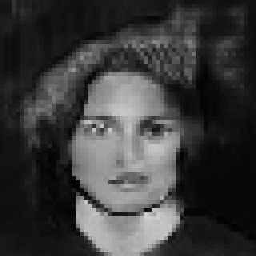

# Face-Generator

This is an example of generative adversarial networks used to generate images of faces. It trained on more than 200,000 images of faces, learning to create new ones. I'm still experimenting with them model architecture, but the results look somewhat decent.

### Example of a real face:

### Examples of generated faces:

This model was trained using the [CelebA](https://www.kaggle.com/jessicali9530/celeba-dataset) dataset, rescaled to 64x64, and converted to grayscale.
